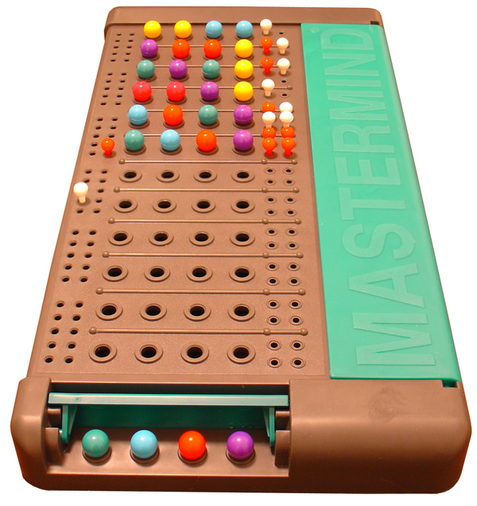

# 🚀 Bagels Game - Program Exploration

This exercise will help you understand the Bagels game program by modifying its code and observing the results.

## 🔬 Exploring the Program

Try to find the answers to the following questions. Experiment with some modifications to the code and rerun the program to see what effect the changes have.

1.  What happens when you change the `NUM_DIGITS` constant?
Ans - 
2.  What happens when you change the `MAX_GUESSES` constant?
3.  What happens if you set `NUM_DIGITS` to a number larger than 10?
4.  What happens if you replace `secretNum = getSecretNum()` on line 30 with `secretNum = '123'`?
5.  What error message do you get if you delete or comment out `numGuesses = 1` on line 34?
6.  What happens if you delete or comment out `random.shuffle(numbers)` on line 62?
7.  What happens if you delete or comment out `if guess == secretNum:` on line 74 and `return 'You got it!'` on line 75?
8.  What happens if you comment out `numGuesses += 1` on line 44?
